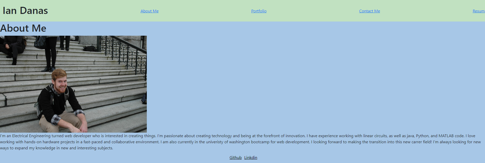

# react-portfolio
## Table of Contents
[Description](#Description)

[Installation](#Installation)

[Usage](#Usage)

[Contributing](#Contributing)

[Tests](#Tests)

[Questions](#Questions)

## Description 
This project serves as a portfolio that potenial clients or employers can look at so learn a little more about me as well as see some of the projects that I have worked on in the past in order to see my level of profiencies in certain areas.
## Installation 
For this application there is no installtion the deployed website can be found at https://64757d1d56504413acbef487--endearing-khapse-44e4d8.netlify.app/ 

## Usage 
To use this website the first thing users will come to is an about me section. This section tells a little more about me in order to ge to know me better. The user can then navigate to another page using the nav bar at the top to then go to the portfolio. On this page the user can see some prior projects I have worked on and either click the button to see the deployed site or go to the github repository. Then there is a contact me page which has a form to fill out. This form will ask for some information. If you try to submit the form without filling out a piece of information then a message will pop up asking you to do so. As well as if you try to submit an invalid email you will get another message letting you know. Finally there is a resume page with a link to my resume and a list of some skills that I have on both the front and back end
## Contributing 
Ian Danas
## Tests 
N/A

## Questions 
if you have an additional questions about the project reach out to me at the github username or the email below

 github: https://github.com/Ian-Danas

 Email: ianmdanas@gmail.com

## Credits
used for email validation: https://stackoverflow.com/questions/46155/how-can-i-validate-an-email-address-in-javascript

